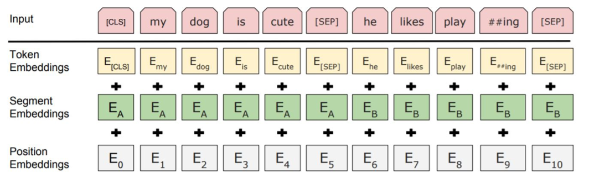
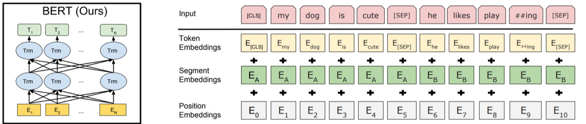
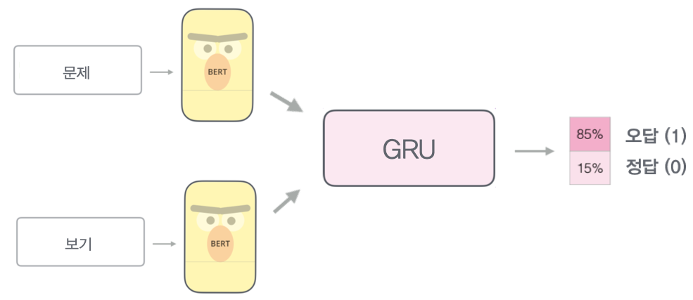

# 머신수능 프로젝트

## Requirements

- transformers 2.1.1
- pytorch 1.3.0

## Data

- 수능, 모의고사 영어 빈칸추론 문제
  - 모의고사
    - 출처: 평가원, EBSi
    - 고등학교 1학년 ~ 3학년
    - 2003~2020 학년도 3,4,6,7,9,10월 모의고사
  -  수능
    - 출처: 평가원
    - 2006~2019학년도
  - Train: 770개 (모의고사 문제)
  - Test: 95개 (수능 문제)

### 문제 예시

2012학년도 수능 25번 (정답률 88%)

What you do in the 15 to 30 minutes after eating your evening meal sends powerful signals to your metabolism. You’ll set the stage for more vigor throughout the evening hours along with a weight-loss benefit if you stay ___________ after your meal. Among many possible activities, walking is one of the easiest ways to get some minutes of exercise after a meal. In fact, research shows that if you walk after a meal, you may burn 15 percent more calories than if you walk the same time, distance, and intensity on an empty stomach.

① active        ② alone        ③ full        ④ satisfied        ⑤ silent

2011학년도 수능 26번 (정답률 14%)
So far as you are wholly concentrated on bringing about a certain result, clearly the quicker and easier it is brought about the better. Your resolve to secure a sufficiency of food for yourself and your family will induce you to spend weary days in tilling the ground and tending livestock; but if Nature provided food and meat in abundance ready for the table, you would thank Nature for sparing you much labor and consider yourself so much the better off. An executed purpose, in short, is a transaction in which the time and energy spent on the execution are balanced against the resulting assets, and the ideal case is one in which ____________. Purpose, then, justifies the efforts it exacts only conditionally, by their fruits.

① demand exceeds supply, resulting in greater returns
② life becomes fruitful with our endless pursuit of dreams
③ the time and energy are limitless and assets are abundant
④ Nature does not reward those who do not exert  efforts
⑤ the former approximates to zero and the latter to infinity

## 참고자료

- MTDNN: https://arxiv.org/abs/1901.11504
- BERT: https://arxiv.org/abs/1810.04805
- SAN: https://arxiv.org/abs/1712.03556

## BERT

#### 임베딩

</img>

#### 모델 구조

</img>

## SAN

</img>

